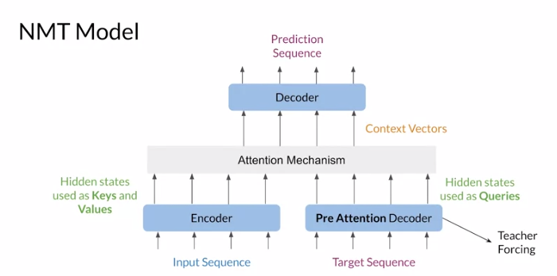
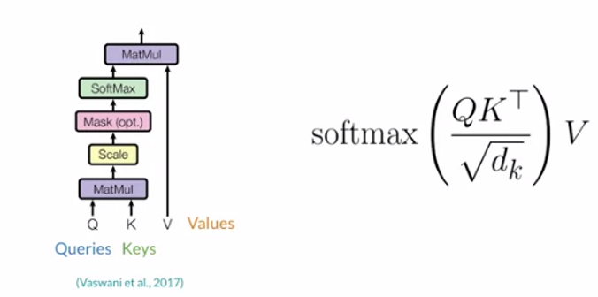

In this [exercise](G_Machine_Translation_with_Encoder_Decoder_Attention.ipynb), I built an English-to-Portuguese neural machine translation (NMT) model using LSTM networks with attention, based on the starting code, instructions, and utility functions from the [Natural Language Processing with Attention Models](https://www.coursera.org/learn/attention-models-in-nlp) course (by DeepLearning.AI on Coursera).

Coursera starting code handled text pre-processing: reading from text files, train-test split, tokenizing and creating Tensorflow dataset.

In this model, we give the decoder access to all parts of the input sentence (because a hidden state is produced at each timestep of the encoder). The hidden states from the encoder are all passed to the attention layer. Thanks to this attention layer, the decoder can learn which of the encoder hidden states to pay more attention to as it tries to produce the next word.



The attention layer implemented in this model is the Scaled Dot Product Attention (please refer to the Coursera lecture for further details).



## Sample translations

After the NMT model is trained, change this line and run the cell following it to translate:
```
english_sentence = "I love reading books"
```

Sample translations:

| **English**                                    | **Portuguese**                                                 |
|------------------------------------------------|----------------------------------------------------------------|
| I love reading books                           | eu eu adoro ler os livros de voces                             |
| The cat is lying on the sofa                   | o gato esta deitado no sofa                                    |
| The teacher gives me a lot of homework         | a professora me entregou muito deveres                         |
| I have been studying math for the past 2 years | eu estive estudando matematica pelo passado pelas ultimos anos |
| You will get a good job if you work hard       | voce vai buscar um bom trabalho se voce trabalham              |

